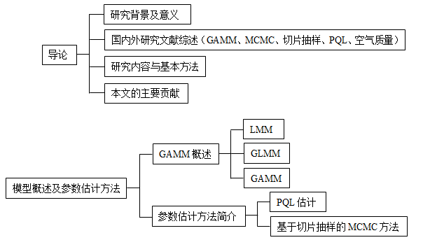
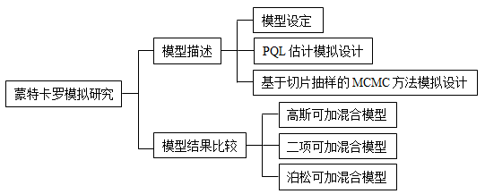
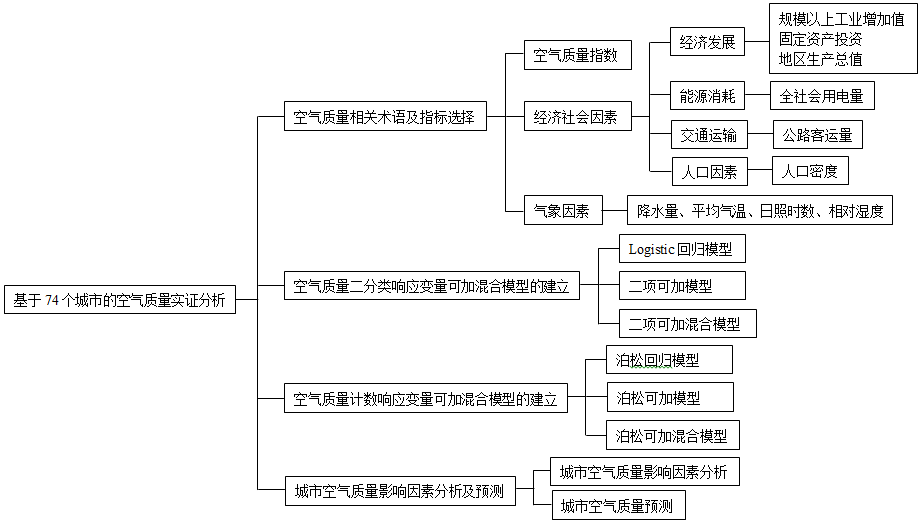
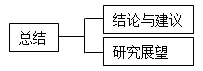
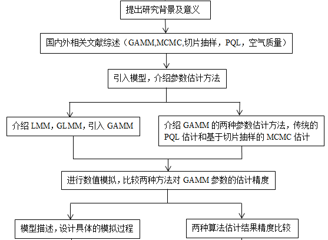
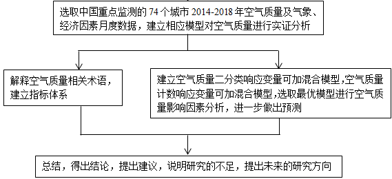

```{r setup, echo=F}
knitr::opts_knit$set(root.dir = getwd())
knitr::opts_chunk$set(echo = FALSE, results = 'hide')
knitr::opts_chunk$set(warning = FALSE, message=FALSE)
```

```{r prepare}
rm(list=ls())
options(digits=4)
options(scipen=100)
graphics.off()
Sys.setlocale("LC_ALL", "Chinese")
```


# 选题背景及意义

### 选题背景

1. 广义可加混合模型既考虑了协变量的线性影响，又考虑了非线性影响，同时考虑了随机
效应，在实际问题分析中，模型设定可能更为精确。
2. GAMM的推断基于似然原理，会涉及高维积分的计算。惩罚拟似然（PQL）是经常采用的
一种估计方法，但在使用中逐渐暴露出一些问题。相应的，基于马尔可夫链蒙特卡罗（MCMC）
的贝叶斯估计备受关注。在MCMC的抽样方法中，Neal（2003）提出切片抽样比Gibbs采样实施
起来更加简单，比M-H抽样更加有效。
3. 为证明GAMM的实用性，考虑GAMM在空气质量方面的应用。近年来，空气质量问题引起了社会
各界的广泛关注，中国粗放型的经济发展模式使空气质量在逐年恶化，空气质量状况的日益下降
警醒我们须及时采取环境保护的相关措施。这就需要我们找到空气质量的影响因素，进而根据影响
因素及影响程度的大小进行相应的处理。

### 选题意义

1. 理论意义
   - 用基于切片抽样的MCMC方法与PQL方法进行估计精度的比较，可以验证GAMM更加精确的
     参数估计方法，为用GAMM进行数据分析提供参考 。
2. 现实意义
   - 以74个城市月度数据建立GAMM进行分析，选择精度较高的估计方法对所建立的模型进
     行估计，可以对空气质量做出更加精确的预测，进而为环境治理决策提供更加有效的
     支撑。 
   - 目前，空气污染非常严重，研究城市空气质量的影响因素，可以证明针对中国的实际
     情况，气象因素和经济因素对空气质量的具体影响效应，及时对短期内空气质量情况
     进行较为准确的简单预报，对空气质量的改善有极大的推动作用。 

# 主要内容、基本思路及论文提纲

### 主要内容

第一部分、第二部分：

```{r fig2,eval=T,echo=F,dev="png",results='markup', cache=F}

```


### 主要内容（续）

第三部分：

```{r fig3,eval=T,echo=F,dev="png",results='markup', cache=F}

```

### 主要内容（续）

第四部分：

```{r fig4,eval=T,echo=F,dev="png",results='markup', cache=F}

```

### 主要内容（续）

第五部分：

```{r fig5,eval=T,echo=F,dev="png",results='markup', cache=F}

```

### 基本思路

```{r fig6-1,eval=T,echo=F,dev="png",results='markup', cache=F}

```

### 基本思路（续）

```{r fig6-2,eval=T,echo=F,dev="png",results='markup', cache=F}

```

### 论文提纲

* 导论
    + 一、研究背景及意义
    + 二、国内外研究文献综述
    + 三、研究内容与基本方法
    + 四、本文的主要贡献

* 第一章 &nbsp; 模型概述及参数估计方法
    + 第一节  GAMM概述
        - 一、线性混合模型（LMM）
        - 二、广义线性混合模型（GLMM）
        - 三、广义可加混合模型（GAMM）
    + 第二节  参数估计方法简介
        - 一、惩罚拟似然估计（PQL）
        - 二、基于切片抽样的MCMC方法

### 论文提纲（续）

* 第二章  蒙特卡罗模拟研究
    + 第一节  模型描述
        - 一、模型设定 
        - 二、惩罚拟似然估计模拟设计
        - 三、基于切片抽样的MCMC估计模拟设计

    + 第二节  模拟结果比较
        - 一、高斯可加混合模型下模拟结果比较
        - 二、二项可加混合模型下模拟结果比较
        - 三、泊松可加混合模型下模拟结果比较

### 论文提纲（续）

* 第三章  基于74个城市的空气质量实证分析
    + 第一节  变量选择及数据说明
        - 一、空气质量相关术语及指标选择
        - 二、数据来源及说明

    + 第二节  空气质量二分类响应变量可加混合模型的建立
        - 一、logistic回归模型
        - 二、二项可加模型
        - 三、二项可加混合模型
        - 四、模型比较
    + 第三节  空气质量计数响应变量可加混合模型的建立        
        - 一、泊松回归模型
        - 二、泊松可加模型
        - 三、泊松可加混合模型
        - 四、模型比较
    + 第四节  城市空气质量影响因素分析及预测
        - 一、城市空气质量影响因素分析
        - 二、城市空气质量预测

### 论文提纲（续）

* 总结
    + 一、结论与建议
    + 二、研究展望

* 参考文献

* 致谢

# 可能的创新点

### 可能的创新点

（1）就参数估计方法来看，目前国内大部分学者在进行GAMM估计时基本上都是利用基于
M-H抽样和Gibbs采样的MCMC方法，还未有人将基于切片抽样的MCMC估计方法应用于GAMM，
且本文应用H.Pham在2018年最新提出的R包gammSlice进行更加精确的求解。

（2）就研究主题来看，通常对于空气质量的研究是基于31个省或部分城市的年度数据，
用月度数据研究的相对较少，且研究方法一般集中于环境库兹涅茨曲线、面板回归模型等，
还未涉及广义可加混合模型的应用。本文选取2014-2018年中国重点监测的74个城市的月度
数据建立广义可加混合模型进行相应研究。
